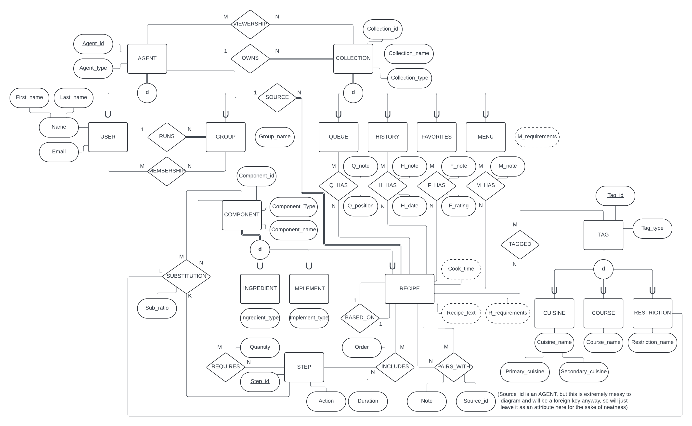
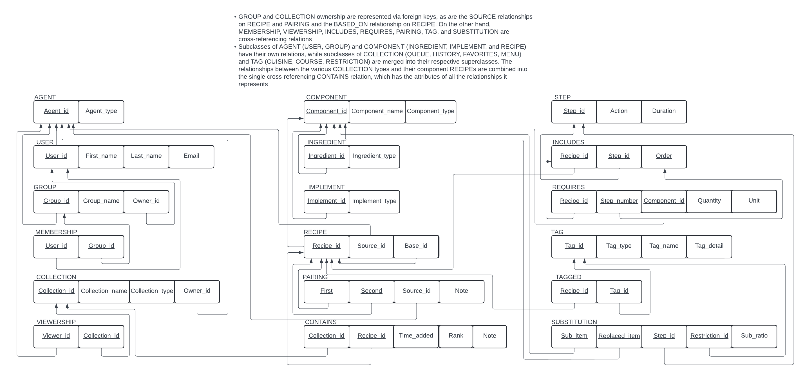

# RecipeDB: A Foray in Database Design
This file outlines data and functional requirements and includes the E-ER diagram and relational schema underlying the database. The SQL folder contains DDL for each relation/table in the RecipeDB schema and DML to seed the database with initial data. The demo.json file includes a series of API queries to get a feel for the implemented functionality of the database API. This document ends with a section highlighting that functionality in more detail.

## Data Requirements
* The database contains records of users, who have unique identifiers as well as names (first and last) and email addresses.
* Users can create and join groups. A group has a unique id and a name. Each group has exactly one owning user, but a user can own many groups, and any number of users can be members of any number of groups.
* Users and groups can create and view recipe collections of several different kinds. Each collection has a unique id, a name, a type, and an owning user or group. A user or group can own any number of collections, and other users and groups can be granted viewing permissions on any number of collections. Collections fall into four categories:
  * Histories store recipes cooked in the past, including the date and time cooked and an optional note.
  * Queues store recipes to try in the future, and each instance of a recipe in a queue should feature a position and an optional note.
  * Favorites lists feature a numeric rating and an optional note for each recipe in the list.
  * Menus store recipes that a user or group plans to cook together. Each instance of a recipe in a menu features an optional note. It may be necessary to generate a list of requirements covering all the recipes in a given menu.
* A recipe features a unique id, a name, and includes an ordered series of steps that comprise it. Each recipe has a source representing the user or group that produced it. If a recipe is based on another recipe, this should be noted. A recipe may or may not feature in one or several pairings, which consist of two recipes along with a source (user or group) and a note. It may be necessary to derive data from a given recipe, including required components, cook time, and/or a text description outlining the steps included.
* A recipe step consists of a unique id (steps may be duplicated within or between recipes), an action, and a duration (e.g. "stir for 10 seconds"). Each step may require any number of components, where a component might be an ingredient, an implement, or another recipe. If a step requires a component, the quantity required should be noted.
* Ingredients and implements each have unique ids, names, and types (e.g. "lime juice" might have type "fruit juice").
* A recipe may be tagged with any number of tags, where each tag is a cuisine, a course, or a dietary restriction (real or potential, e.g. "can be made vegetarian"). Each tag should have a unique id. Courses and restrictions should have names, while cuisines may need both a primary and secondary descriptor.
* Restrictions prompt substitutions, where a substitution replaces one component in a given recipe step with a different component in order to satisfy the restriction. When a substitution exists, the ratio (e.g. 2:1 kosher salt to table salt) should be noted.

## Functional requirements
The following requirements were requested by surveyed end users. Sections in **bold** are implemented in the existing design, while others may appear in a future update.
* Users should be able to create and delete groups, and add and remove users for groups they run.
* **Users and groups should be able to create and delete collections of various types, and add and remove recipes for collections they own.**
* **Users should be able to create recipes, and to duplicate existing recipes with modifications. These recipes should include the various components of the recipe ecosystem, including steps, components, tags,** pairings, and substitutions.
* Users should be able to generate a list of requirements for a given recipe or menu.
* **Analysts should be able to view aggregate statistics on collections including how frequently a given recipe has been queued or cooked in the recent past.**

## E-ER Diagram

## Relational Schema

## API Reference
The functionality of this API module includes the following endpoints:

### HealthCheck
* A GET request sent to http://localhost:8080/HealthCheck/ should return the string "I'm healthy..." if the server module is in a functional state.

### User
* A POST request sent to http://localhost:8080/User/ will create a user if the POST body contains firstName, lastName, and email JSON fields alongside an id field that does not match an agent (user or group) already existing in the database.
* A GET request sent to http://localhost:8080/User/{id} will retrieve information about the user with that id, including first and last name, email, groups the user owns or is a member of, collections the user owns or can view, and recipes the user has published.
* A GET request sent to http://localhost:8080/User/ will retrieve the same information for every user in the database. Usage is not recommended.
* A PUT request sent to http://localhost:8080/User/{id} will update the user with that id in accordance with the firstName, lastName, and email fields specified in the request body. Note that this cannot change a user's id field or change the user's groups, collections, or recipes.
* A DELETE request sent to http://localhost:8080/User/{id} will delete the associated user from the database. Because of the limitations on foreign key cascade behavior in mssql, this endpoint contains substantial business logic for deletion-related cleanup.

### Collection
* A POST request sent to http://localhost:8080/Collection/ will create a collection if the POST body contains an integer id not already assigned to another collection, a name, a type (e.g. "history"), and an owner integer matching the id of an existing agent in the database.
* A POST request sent to http://localhost:8080/Collection/{id} will add a recipe to the specified collection if the body includes an id corresponding to a recipe in the database, alongside an integer rank value and a text-based note field.
* A GET request sent to http://localhost:8080/Collection/{id} returns the contents of the collection with that id.
* A GET request sent to http://localhost:8080/Collection/ returns the contents of all collections in the database. Usage is not recommended.
* A PUT request sent to http://localhost:8080/Collection/{id} can be used to update the name of the specified collection to match the name field of the request body.
* A PUT request sent to http://localhost:8080/Collection/{source_id}/{dest_id} is used to move the rank-1 element in an ordered queue specified by {source_id} to a history collection specified by {dest_id} and to decrement the ranks of all other recipes in the source queue. This fulfills an important semantic constraint for ordered queues, but confirming that the source and destination collections are the correct types, which is necessary for this operation to behave reasonably, is left to the caller.
* A DELETE request sent to http://localhost:8080/Collection/{id} deletes the corresponding collection, which also deletes its contents and viewer permissions via CASCADE.
* A DELETE request sent to http://localhost:8080/Collection/{collection_id}/{recipe_id} removes all instances of the specified recipe from the specified collection.

### Recipe
* A POST request sent to http://localhost:8080/Recipe/ will create a new recipe with the specified id (which cannot match an existing component), name, source (which must match an existing agent but can default to a dummy agent with id -1), and base (which much match an existing recipe but can default to a dummy recipe with id -1) values. The recipe will be assigned steps and required components as specified by the request body, but these data must match values already in the database. The ability to add new steps and non-recipe components to the database via the API is currently not implemented.
* A GET request sent to http://localhost:8080/Recipe/{id} retrieves data for the specified recipe, including the components required for each of its steps.
* A GET request sent to http://localhost:8080/Recipe/ retrieves data for every recipe in the database; usage is not recommended.
* A PUT request sent to http://localhost:8080/Recipe/{id} allows the source and base ids for the specified recipe to be updated to those contained in the request body.
* A DELETE request sent to http://localhost:8080/Recipe/{id} deletes the associated recipe, removing it and various references to it (in collections, pairings, tags, etc.). Recipes based on the deleted recipe are updated to instead be based on whatever the deleted recipe was based on (think linked list deletion), which is a fun semantic constraint.

### Tag
* A POST request sent to http://localhost:8080/Tag/ creates a new tag with the specified id (if not already assigned to a tag), type, name, and detail fields.
* A POST request sent to http://localhost:8080/Tag/{recipe_id}/{tag_id} applies the specified tag to the specified recipe.
* A GET request sent to http://localhost:8080/Tag/{id} fetches stored information about the tag with matching id.
* A GET request sent to http://localhost:8080/Tag/ fetches stored information about all tags in the database.
* A GET request sent to http://localhost:8080/Tag/{id}/recipes retrieves summary information about all recipes with the corresponding tag.
* A PUT request sent to http://localhost:8080/Tag/{id} updates the type, name and detail fields of the corresponding tag to match those found in the request body.
* A DELETE request sent to http://localhost:8080/Tag/{id} removes the specified tag from all recipes and then deletes it.

### Analytics
* A GET request sent to http://localhost:8080/Analytics/Popular/{k} retrieves the names and frequencies of the k most commonly-occurring recipes across all user collections over the prior 7 days.
* A GET request sent to http://localhost:8080/Analytics/MostQueued/{k} retrieves the names and frequencies of the k most commonly-occurring recipes across all non-history collections over the prior 7 days.
* A GET request sent to http://localhost:8080/Analytics/MostCooked/{k} retrieves the names and frequencies of the k most commonly-occurring recipes across all history collections over the prior 7 days.
